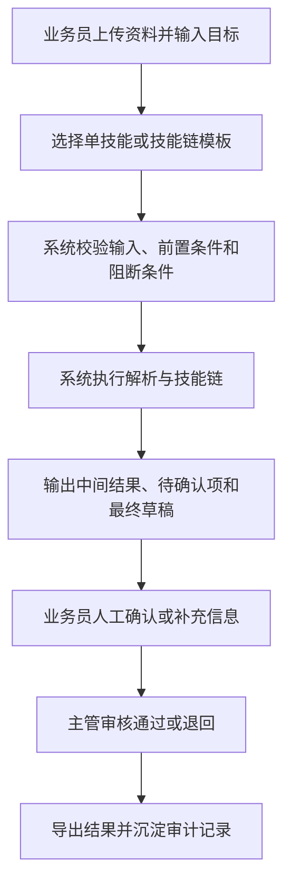

# 外贸助手 V1 流程文档

## 1. 流程目标
将业务员执行、主管审核、技能调用和产物沉淀明确成正式流程，特别把“人工确认”定义为必经节点。

## 2. 角色泳道
- 业务员：上传文件、选择技能、查看结果、确认修改
- 主管：审核输出、退回、发布模板、复盘质量
- 系统：执行技能、生成中间结果、提示风险、保存审计产物

## 3. 通用任务流程

## 4. 业务员工作流程
### 4.1 发起
- 上传工艺单、批注、客户邮件等资料
- 填写任务目标和补充说明
- 从技能目录中选择单技能或技能组合模板

### 4.2 执行
- 系统检查文件是否完整
- 系统检查技能前后置依赖
- 系统执行解析、抽取、生成和格式化

### 4.3 确认
- 业务员查看结构化结果
- 业务员处理待确认项
- 对关键字段进行人工补录或修改

### 4.4 提交审核
- 将结果提交主管审核
- 或在低风险场景下直接保留为个人草稿

## 5. 主管流程
### 5.1 审核
- 查看输入资料、执行链路、中间结果和最终输出
- 核查待确认项是否被正确处理
- 通过或退回

### 5.2 复用
- 将高质量执行链保存为模板
- 调整技能组合规则
- 发布新的技能卡片或模板

### 5.3 复盘
- 查看常见退回原因
- 查看高风险输出分布
- 优化模板、审核点和技能说明

## 6. 三条首批业务流程
### 6.1 工艺单 -> 面辅料 BOM
1. 业务员上传工艺单与相关资料
2. 选择“BOM 整理”技能或对应模板
3. 系统解析文档，抽取料号、规格、颜色、单位等字段
4. 系统输出 BOM 初稿和缺失字段清单
5. 业务员确认关键字段并补录缺失项
6. 主管审核通过后导出

### 6.2 多意见/批注 -> 翻译与归并
1. 业务员上传批注文本、意见汇总或聊天记录
2. 选择“意见翻译与归并”技能
3. 系统进行翻译、去重和主题归并
4. 系统输出双语结果和歧义项
5. 业务员确认专业术语和责任归属表达
6. 主管审核通过后形成正式输出

### 6.3 客户资料/上下文 -> 英文回复草稿
1. 业务员上传客户上下文和附件
2. 选择“客户回复草拟”技能
3. 系统整理上下文并生成英文草稿
4. 系统列出缺失信息和待确认承诺项
5. 业务员修改草稿并确认高风险内容
6. 主管审核通过后用于外发

## 7. 人工确认流程
人工确认不是附加动作，而是正式流程节点。

必须进入人工确认的场景：
- 价格相关表述
- 交期相关表述
- 认证、合规、测试结论
- 付款与物流承诺
- 工艺单字段识别冲突
- 翻译中的歧义、责任归属与否定表达

人工确认后的结果必须留痕：
- 谁确认
- 确认了什么
- 是否有手工修改
- 最终审核结论

## 8. 模板与沉淀流程
1. 主管从已通过任务中挑选高质量结果
2. 将技能链保存为 `WorkflowTemplate`
3. 绑定输入要求、阻断条件和审核点
4. 发布给业务员使用
5. 后续根据退回原因持续优化

## 9. 审计与回溯流程
- 系统保存上传资料、技能链路、中间产物和最终结果
- 支持按任务、用户、时间和技能模板回查
- 支持查看主管退回原因和人工修改记录

