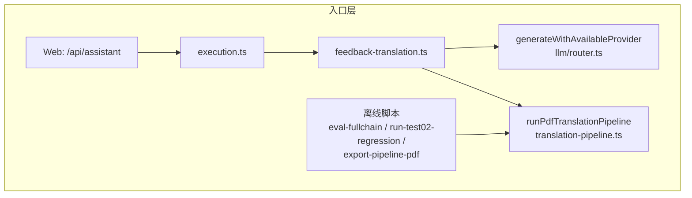
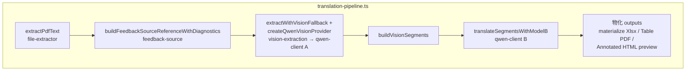
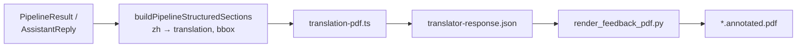
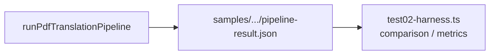

# Translation Design

## Scope

本文描述当前仓库里“翻译文档处理链”的设计现状，重点覆盖：

- 输入文档抽取
- 翻译任务执行
- PDF 标注输出
- 不同文档类型的呈现策略
- 当前已知限制与后续优化方向

本文只描述当前已实现或已验证的设计，不引入未来未落地的能力假设。

## PDF 翻译链路架构图（评审落库，2026-03-29）

本节将「入口层 / 识别与翻译主管线 / Web 版式 PDF 渲染 / 评测」分层关系固化为文档，与实现对照；后续演进以代码与 `plan.md` 为准。

### 架构要点（与图一致）

1. **两套 LLM 调用体系并行存在**：`qwen-client.ts` 直连 HTTP（Pipeline A/B）；`llm/router.ts` 多 provider 路由（`feedback-translation` / `execution` 等技能链）。Web 上传若仍走后者，可能出现 `codex-cli` 等 fallback，与 Pipeline 主链不一致。
2. **主管线为 `runPdfTranslationPipeline`**（`translation-pipeline.ts`）：抽取 → A 视觉补强 → `buildVisionSegments` → B 翻译 → 物化（HTML / xlsx / table-style pdf 等）。
3. **第二条渲染链（原文叠字 PDF）**：正式 annotated PDF 现在只消费 `translation_snapshot_v1`，由 `runPdfTranslationPipeline` 冻结快照 → `translation-pdf.ts` 写 `translator-response.json` → `scripts/render_feedback_pdf.py` 生成 `*.annotated.pdf`。
4. **评测层**：`run-test02-regression.ts` / `eval-fullchain.ts` 等直接消费 `PipelineResult`，经 `test02-harness` 比较，不经过 Web 渲染链。

### 图 1：入口层与双轨 LLM

说明：`Router` 与 `Pipe` 内 B 模型调用**不是同一路径**；PDF 主链应以 `qwen-client` 的 `callTranslationModelChat` 为准（见 `translation-pipeline.ts`）。

### 第一阶段收口落地（2026-03-29）

- Web 侧 `feedback + comment-translator + pdf` 任务已收口到 `runPdfTranslationPipeline()`，不再对这类正式 PDF 任务回退到 `llm/router.ts` 的旧翻译路径。
- annotated 正式 PDF 已新增冻结中间层 `translation_snapshot_v1`：
  - snapshot 直接来自 `PipelineResult.segments` + `outputs.annotatedPdf.items`
  - `translation-pdf.ts` 与 `render_feedback_pdf.py` 只消费 snapshot，不再消费 `buildPipelineStructuredSections()` 生成的旧 `sections`
- 同一任务的正式 PDF 重新下载现在只做“基于 snapshot 的重渲染”，不应再隐式重跑 A/B 造成内容漂移。

### 第一阶段后的直接优化重点（2026-03-29）

- 优先稳定 B 模型在目标环境下的中文产出，而不是继续改 annotated 架构。
- 当前已补充两类运行门槛：
  - role 级超时：`TRANSLATION_MODEL_API_TIMEOUT_MS` / `VISION_MODEL_API_TIMEOUT_MS`
  - B 侧 transport retry：`B_MODEL_TRANSPORT_RETRY_LIMIT`
- 当前已新增固定样本冒烟脚本：
  - `npm run smoke:pdf`
  - `npm run smoke:pdf` 默认只跑快速集（当前为 `M422123`）
  - `npm run smoke:pdf:full` 跑 `M422123` + `data/local/manifest.json` 中的 source_pdf
  - gate 关注 `translatedSegmentCount`、`zhPopulationPct`、`bModelBatchJsonOk/bModelBatchAttempts`、`bModelLastErrorKind`
- 当前默认参数：
  - fast: `maxSegmentsForTranslation=60`、`sampleTimeoutMs=90000`
  - full: `maxSegmentsForTranslation=40`、`sampleTimeoutMs=180000`
- 2026-03-29 实测：
  - fast 已通过：`M422123` → `zhPopulationPct=100`、`bJson=33/33`
  - full 已通过：
    - `M422123` → `100%`
    - `Macade TP Cici Rain Jacket W` → `44%`
    - `Cici Rain Jacket - sketch` → `40%`
  - 当前 full 的通过含义是“B 调用与脚本运行稳定、能在有界时间内产出中文”，不是“这些样本已经达到最终业务完稿覆盖率”
- 结论上，后续“快照里没中文”的问题应先通过配额 / timeout / batch / retry 收敛，而不是继续修改正式 PDF 渲染层。

### 第二阶段起点：A 稳定性先做锚定，不先大改策略

- 当前已在 `vision-extraction.ts` 与 `buildVisionSegments()` 增加轻量模糊去重：
  - 先比较 compact 文本
  - 再比较 token overlap / bigram overlap
- 当前原则仍然是“文本层 segment 优先”：
  - 若 vision block 与同页文本层 segment 高相似，则视为已有锚点，不再重复追加
  - 若同页已有更稳定的 text_layer block，则去重时优先保留 text_layer
- 当前 `selectSegmentsForTranslation()` 已新增 vision 保留配额：
  - 默认按 `B_MODEL_RESERVED_VISION_SHARE=0.25`、`B_MODEL_RESERVED_VISION_FLOOR=4` 预留 vision 段位
  - 先 round-robin 选一批 vision segment，再用剩余预算选 text_layer / merged segment
  - 目标不是增加总翻译条数，而是避免低配额场景下 OCR 补强块被长页文本层完全挤掉
- 对 `mixed` 文档，当前已新增 sketch 页保留名额：
  - 默认按 `B_MODEL_RESERVED_MIXED_SKETCH_SHARE=0.35`、`B_MODEL_RESERVED_MIXED_SKETCH_FLOOR=8`
  - 在 mixed 文档里，先给 `pageLayoutType=sketch` 的 segment 留一部分翻译预算，再进入 vision 配额与常规 round-robin
  - 目标是让 annotated 导向样本优先翻 sketch 页业务批注，而不是被 table/reference 页残片吃掉预算
- 当前已新增二阶段 vision 补翻窗口：
  - `B_MODEL_VISION_SECOND_STAGE_ENABLED=1` 时，在首轮 + retranslate 后，再从“未进入 scopedSegments 的高价值 vision 段”里补挑一小批
  - 默认参数：`B_MODEL_VISION_SECOND_STAGE_MAX_SEGMENTS=8`
  - 仍然只复用 B 模型，不改 snapshot 契约，不允许渲染层自行补翻
- 2026-03-29 实测：
  - `Cici Rain Jacket - sketch.pdf` 在 `maxSegmentsForTranslation=40` 下，总译段仍为 40
  - `translatedBySource.vision` 已从 5 提升到 10，说明 vision 补强内容更稳定进入 B 翻译
  - 引入二阶段 vision 补翻后，在同样 `maxSegmentsForTranslation=40` 下：
    - `translatedBySource.vision` 已从 10 提升到 16
    - 未翻译的 vision 段从 6 降到 0
    - 总已翻译 segments 提升到 46，说明“预算外高价值 OCR 块”已经能稳定补进中文
  - 再引入 mixed-sketch 保留名额后，在同样 `maxSegmentsForTranslation=40` 下：
    - `translated` 总量从 46 提升到 48
    - `pageLayoutType=sketch` 的已翻 segment 从 6 提升到 9
    - 说明 mixed 样本已经开始更明显地向 sketch 页业务批注倾斜，而不是继续把预算压在 table/reference 页
- mixed annotated 输出当前新增了一层“页型感知 suppress”：
  - `pageLayoutType=table/reference` 的条目默认更严格
  - 只有明显结构/工艺变更类内容（如 zip、velcro、pocket、hem、waistband、cuff、seam 等）才继续保留到正式 annotated
  - 目标不是影响翻译主数据，而是减少 mixed 正式稿里表格残片、规格碎片和参考页噪音
- mixed 文档的当前最小页级分治：
  - 主输出仍保留 `annotated_pdf`
  - 但会额外生成一个补充 `bilingual_table_bundle`，只承接 `pageLayoutType=table/reference` 的 segment
  - 这意味着 mixed 样本现在可以同时提供：
    - sketch / 可视批注页：正式 annotated
    - table / reference 页：补充 xlsx + table-style pdf
  - 当前阶段不改变 `outputStrategy` 字段，只把 table/reference 产物作为 mixed 的附加下载物
- mixed 页级自动补强的当前边界：
  - 只对 mixed 文档中的 `sketch` 页做自动整页 vision 触发
  - `reference` / `mixed` 页仍主要由 early-gate / low-confidence 诊断驱动
  - 原因是 `Cici` 实测里，放开到 `reference + mixed` 页会把 vision 总量从 16 拉到 48，但真正有中文的 vision 条数不增加，纯增噪
- 这一轮先引入了轻量 vision 保留配额和 mixed-sketch 自动补强，但仍未做更激进的“vision 独立翻译预算 / 页级二阶段调度”；当前目标只是先降低“同一页轻微 OCR 波动导致新增/丢失 segment”的概率。

### 图 2：translation-pipeline 主管线（识别 → 翻译 → 物化）

输出：`PipelineResult`（`segments[].zh`、`outputs`、`diagnostics`）。

### 图 3：Web 侧版式 PDF（第二条渲染链）

### 图 4：评测层（与渲染链解耦）

### 与上图对应的关键文件

| 层级 | 主要职责 | 关键路径 |
|------|----------|----------|
| 入口 / 编排 | Web 与技能链 | `src/app/api/assistant/route.ts`、`execution.ts`、`feedback-translation.ts` |
| LLM 路由（非 Pipeline 主 B） | 多 provider | `src/lib/assistant/llm/router.ts` |
| Pipeline A/B（直连） | 视觉 + 翻译 HTTP | `src/lib/assistant/qwen-client.ts` |
| 识别融合 | 文本层 + early gate + 低置信 | `src/lib/assistant/feedback-source.ts` |
| 视觉补强 | A 模型整页 OCR | `src/lib/assistant/vision-extraction.ts` |
| 翻译与产物 | 主管线 | `src/lib/assistant/translation-pipeline.ts` |
| 版式 PDF | 叠字渲染 | `src/lib/assistant/translation-pdf.ts`、`scripts/render_feedback_pdf.py` |
| 回归评测 | 不经过 Web PDF | `scripts/run-test02-regression.ts`、`scripts/lib/test02-harness.ts` |

## Current Baseline (2026-03-27)

本轮已确认的设计基线如下：

1. A/B 模型分离
- A 模型：视觉/OCR/多模态辅助识别
- B 模型：结构化 segment 翻译
- 当前环境变量基线：
  - `VISION_API_KEY / VISION_API_URL / VISION_MODEL`
  - `TRANSLATION_API_KEY / TRANSLATION_API_URL / TRANSLATION_MODEL`

2. PDF feedback 走 pipeline-first
- 对上传 PDF 的 `feedback` 任务，优先走 `runPdfTranslationPipeline()`
- 不再把 `comment-translator` 文本主链作为唯一成功条件

3. 当前主矛盾是识别召回，不是单纯翻译质量
- `M422123.pdf` 的问题已证明：
  - 之前很多“漏翻”本质是未进入 segment
  - 先找准，再翻准

4. 当前业务 PDF 的渲染策略
- 稀疏页优先“页内蓝色中文贴近原文”
- 右侧 `CN Notes` 只作为溢出兜底
- `Unassigned Notes` 默认不进入正式 PDF
- 款号、代码、SKU 不重复翻译展示

5. 本地模型接入基线（2026-03-27）
- 本地 OpenAI-compatible 端点 `http://172.16.71.201:8001/v1` 已验证可连通
- 本地 `Qwen3.5-35B-A3B` 作为 B 模型时可用于低成本联调，但需要：
  - 关闭或压制 thinking 输出
  - 给更高 `max_tokens`
  - 使用更保守的 batch
- 对本地 `llama.cpp` 部署的统一接入要求：
  - 无论文本还是图像请求，最终答案都必须稳定写入 `choices[0].message.content`
  - 若接口只返回 `reasoning_content` / `thinking`，即使 HTTP 200 也不能视为 A/B 主链可用
  - 若经常出现 `finish_reason=length`，应优先调整部署输出预算，而不是继续扩大业务 prompt
- 因此本地 A/B 是否可替代线上，不取决于“能否返回 200”，而取决于“能否稳定产出可消费的最终 content / JSON”
- 本轮对 `Qwen3.5-35B-A3B-Q3_K_M.gguf` 的实测结论：
  - `/v1/models` 可正常返回，服务已启动
  - 文本与结构化翻译请求会返回 `message.content`，但内容当前退化为连续 `?`，并伴随 `finish_reason=length`
  - 多模态 OCR 对部分页面可返回非空结果，但对另一些页面会直接报 `500 failed to process image`
  - 因此当前这台本地 `llama.cpp` 实例仍不满足 A/B 主链稳定接入条件
- 本轮对 ModelScope 在线 B 模型的实测结论（2026-03-27）：
  - `Qwen/Qwen3.5-397B-A17B` 可返回可消费翻译内容，但经常直接返回裸数组 JSON，例如 `[{"id":"seg-1","text":"..."}]`
  - 因此服务端 B 解析器必须接受两种形态：
    - `{"translations":[{"id":"...","zh":"..."}]}`
    - `[{"id":"...","text":"..."}]`
  - `ModelScope` 上带斜杠的模型 id 必须强制走 ModelScope provider / endpoint，不能误落到 DashScope
  - `chat/completions` 请求必须显式带 `stream:false`，否则部分 ModelScope 模型会返回 `choices:null`
  - 当前 `Qwen/Qwen3.5-397B-A17B` 仍存在间歇性 `choices:null` 与 rate limit，需要更保守的 batch / token / delay 才能稳定跑完整份 PDF
  - 2026-03-27 当前这把 key 对 `moonshotai/Kimi-K2.5` 已触发日配额 / 限流，导致 A 模型 OCR 验证被阻塞
- 本轮对指定线上组合的实测结论（2026-03-27）：
  - A：`ModelScope Qwen/Qwen3.5-35B-A3B`
  - B：`DashScope compatible-mode qwen3.5-27b`
  - `Qwen/Qwen3.5-35B-A3B` 可稳定接收图像输入并返回可消费 OCR 内容，`M422123.pdf` 的 Page 1/2 本轮返回了 26 个 vision blocks
  - `qwen3.5-27b` 在 `https://dashscope.aliyuncs.com/compatible-mode/v1/chat/completions` 可稳定返回结构化翻译内容
  - `qwen3.5-27b-instruct` 在该 endpoint 上不存在；`qwen3.5-27b` 才是当前有效 model id
  - `qwen3.5-flash` 在当前账号上触发了 free-tier 限制，不适合作为本轮默认 B
  - 基于该组合，`M422123.pdf` 已跑到：
    - `aModelExecuted=true`
    - `bModelExecuted=true`
    - `translatedSegmentCount=25`
    - `translationCoveragePct=100`
    - 正式 PDF：`/Users/weitao/Documents/buildworld/aigc/export-agent/.tmp/exports/M422123.current.annotated.pdf`
  - 对应正式 PDF 的中间 response 不含 `Unassigned Notes`，且包含 `02 NOIR`、`SHELL FABRIC OPTION #1`、`POCKETING`、`Back elasticated waistband`
6. `M422123.pdf` 与人工翻译对照后的新增结论（2026-03-28）
- 之前“很多内容没翻”的主根因已确认不是 A/B 主链没产出，而是导出到正式 PDF 的 helper script 丢了 `bbox`
- 一旦 `scripts/export-pipeline-pdf.ts` 把 `segment.extractionMeta.bbox` 透传到 `response.json`，Page 1/2 的业务块就能重新进入 `render_feedback_pdf.py` 的页内定位
- 正式 PDF 渲染还需要额外抑制低业务价值 header/meta：
  - `HIVER ...`
  - `EN ATTENTE ...`
  - `DOSSIER STYLE`
  - 页脚版权 / 编辑日期
- `render_feedback_pdf.py` 已新增两类策略：
  - 对宽 bbox 的材料/袋布块，放宽页内蓝字宽度与字数上限，避免过早截断
  - 对稀疏 sketch 页，继续优先页内蓝字贴近原文；不让 season/status 之类 header 抢占可视资源
- 后续又新增一条更硬的渲染约束：
  - 页内蓝字候选框若与原文 `bbox` 重叠，则直接放弃该位置
  - 目标是“贴近原文但不压英文”，放不下时外移或进入补充区域
- B 模型提示词也已收紧为“服装工艺单短句/标签式表达”，减少解释型直译
- B 结果后处理已新增服装工艺术语归一，用于把自由翻译收敛到更接近人工稿的表达，例如：
  - `Back elasticated waistband` → `后腰部橡筋`
  - `Chino pocket + pleat` → `斜插侧袋`
  - `15mm piped pocket` → `15mm单开线口袋`
  - `Dart` → `省`
  - `POCKETING ...` → `袋布：涤棉磨毛斜纹，配色同面布`
  - `17 PLASTIC SNAP ... TOP FRONT FLY BUTTON` → `17mm塑料四合扣黑色门襟用`
- 额外确认的线上根因：Web 正式 PDF 下载接口原先会在 `.tmp/task-artifacts/<taskId>/` 下命中已有 `annotated.pdf` 时直接返回旧文件，不会重新渲染
  - 这会导致“response.json 里已经有新的翻译，但页面下载到的正式 PDF 仍是旧稿”
  - 当前已改为每次根据最新 structuredData 重写 `translator-response.json` 并重新调用 `render_feedback_pdf.py`
- 按人工参考样本 `/Users/weitao/Documents/buildworld/aigc/export-agent/data/test02/M422123翻译.pdf` 对比，当前 AI 正式 PDF 已达到较高匹配度：
  - Page 1：颜色、主料选项、袋布、四合扣、拉链、洗水/车缝说明均已落到页内
  - Page 2：后腰松紧、口袋+褶裥、17mm 四合扣、15mm 口袋、省道均已落到页内
  - `Unassigned Notes` 不再出现在正式 PDF
7. `test02` 回归评测链新增结论（2026-03-28）
- `scripts/lib/test02-harness.ts` 不能再只做“按索引顺序 side-by-side”；这会把人工稿中常见的“1 条英文批注拆成 2~3 条中文短句”误判成缺失
- 当前 `test02` comparison 已升级为：
  - 先过滤低业务价值项（header / copyright / admin meta）
  - 再分别为每个参考条目、每个 AI 条目寻找最佳匹配
  - 最终输出 `comparisonStatus / referenceRecallPct / aiPrecisionPct / unmatchedReference / unmatchedAi`
- `M422123` 在该新口径下已达到 `pass`
- `M415013` 暂未通过，但已确认主问题不再是链路失败，而是两类质量差异：
  - annotated 输出仍需继续压 admin/meta 噪音
  - 某些长批注需要术语/短句模板化，才能贴近人工稿的拆句方式
- 因此后续 `test02` 推进策略应为：
  - 线上模型优先跑 sketch/comment 样本
  - token / 配额不足时用本地 B 模型补跑大样本
  - 所有样本统一回收至同一 `runId` 下，再做 comparison 汇总与人工复核
9. mixed 样本的最新收敛结论（2026-03-29）
- `hanna` 与 `m4e002` 进一步证明：mixed 文档的主要风险不是“没翻到”，而是 comparison 和正式稿把版面断行、规格残片、页眉元信息一并当成业务候选
- 已验证有效的收敛手段：
  - 参考侧允许相邻中文短句按语义合并，避免人工稿的多行短批注被误判成缺块
  - AI 侧只拆明确多列/多块，不拆逗号短句，避免 `aiCandidateCount` 被残片虚高
  - mixed annotated / comparison 对 standalone `款号 / 成分 / 克重 / 幅宽 / created / supplier / original sample` 做更强降噪
- 实测结果：
  - `m4e002` comparison 已从 `referenceRecallPct=38 / aiPrecisionPct=29` 提升到 `63 / 35`
  - 说明主问题已从“识别不到”收敛为“Page 2 / Page 5 的结构批注和 mixed 噪音控制还不够像人工稿”
- 因此 mixed 样本的主收敛方向应是：
  - 先收 comparison canonicalization 和业务降噪
  - 再补结构批注短句模板
  - 最后才考虑是否需要换模型
10. 正式 PDF 渲染安全模式（2026-03-29）
- 业务反馈已确认：浮动蓝字虽然“贴近原文”，但会遮挡服装图细节和英文批注，存在后续打样/设计误读风险
- 因此正式 PDF 默认渲染策略调整为：
  - 非 dense 页：优先小号 marker + 右侧说明栏，不再默认把中文浮在原页内容区
  - dense 页：优先 marker + review 页，不再默认在原页底部压 inline 中文块
  - `FITTING / VOLUME`、`SIZE ... BASE ...` 等尺码框默认不进入正式翻译标注
8. sketch/comment 样本的最新收敛结论（2026-03-29）
- `m445033` 之前的 fail 已证明：主问题不是整页没识别，而是以下三类偏差叠加：
  - 颜色/尺码标/主标等短标签格式和人工稿不一致
  - 材料/里布/填充被模型翻成长说明，人工稿只保留短标签
  - `front opening + cuffs`、`NM 120 4.5pts/1cm`、版权页眉等上下文噪音没有被 comparison / 正式稿降级
- 已验证有效的收敛手段：
  - 在 `normalizeFashionTranslation()` 中把 sketch 典型术语压回人工短句，例如：
    - `48 MARINE` → `48#海军蓝`
    - `LINING ... 02 NOIR` → `身里春亚纺 黑色`
    - `PADDING SAME WEIGHT AND QUALITY AS M145023` → `填充：与M145023相同`
    - `NEW LOGO LABEL` → `新logo主标`
    - `84851 on front opening` → `门襟84851四合扣`
  - 在 `test02-harness.ts` 中补充 business canonicalization，让“面料1与M245013相同面料 / 面料：华悦…同M245013”这类一长一短的表达能够归一到同一业务概念
  - 对 `for middle front opening + cuffs`、`NM ... pts/1cm`、`L&M`、`ORIGINAL IDEA ...` 等非业务短标签做 comparison 降级，避免噪音拖低 precision
- 实测结果：
  - `m445033` 已从 `fail` 提升到 `pass`
  - run: `/Users/weitao/Documents/buildworld/aigc/export-agent/data/test02/runs/20260329-m445033-online-v2/`
  - 指标：`referenceRecallPct=88`、`aiPrecisionPct=68`
- 这说明 sketch/comment 样本的主收敛方向仍应是：
  - 先压术语、拆句和噪音
  - 再看是否需要切更强模型
  - 不应把“人工短标签风格差异”误判成“完全没识别”

## Approved Near-Term UI Refactor

以下内容不是“已实现状态”，而是已经确认、将紧接着落地的翻译工作台收口方案。后续前端修改默认以这里为 UX 基线：

1. 首页默认单场景
- 默认服务“意见翻译”
- 首屏只保留：
  - 上传文件
  - 处理要求
  - 开始翻译

2. 高级设置默认折叠
- `角色 / 模板 / 技能` 不再作为首屏主决策区
- 收进“高级设置”折叠区，仅在需要时展开

3. 上传后必须给明确指引
- 明确告诉用户：
  - 已上传几个文件
  - 默认将执行什么
  - 下一步应点击什么
- 执行中要展示阶段状态，而不是仅显示“处理中...”

4. 结果区以翻译结果为第一优先级
- 处理完成后，结果区顶部第一块固定为“翻译结果”
- 优先提供：
  - 页面查看
  - 打开翻译结果
  - 下载翻译 PDF

5. 审计与审核信息下沉
- `待确认项` 仍保留在结果区上半部
- `审计摘要 / 审核历史 / 最近任务` 下沉，不再压过翻译结果主入口

## Current Goal

当前翻译链服务的核心场景是：

1. 上传英文工艺意见、sketch、tech pack、TP/BOM 类 PDF
2. 抽取可翻译文本
3. 输出中文翻译结果
4. 生成便于业务确认的 PDF 结果

对于当前 Web 工作台，这个目标需要补一层更明确的页面表达：

1. 翻译结果必须“好找”
- 用户完成一次翻译后，不应再去“中间产物”里翻找结果
- 页面上应有明确的翻译结果主卡片

2. 翻译结果必须“可打开 / 可下载”
- 页面内至少应支持：
  - 页面查看双语结果
  - 打开翻译结果
  - 下载翻译 PDF

3. 上传后的下一步必须明确
- 上传并不会自动等于“开始翻译”
- 页面必须明确告诉用户下一步动作和当前阶段

当前代码没有显式按“文档类型”切两套执行器，而是主要按页面翻译项密度选择渲染模式：

1. 非密集页
- 典型特征：短句批注较少、空白较多
- 目标输出：原文附近编号 + 右侧面板或同页空白区中文说明

2. 密集页
- 典型特征：表格密集、字段多、说明短而碎
- 目标输出：原页保留定位编号，同页空白区优先放 `CN Notes`，放不下的剩余内容进入补充审阅页

## End-to-End Pipeline

当前链路分 4 层：

1. File Extraction
- 文件上传后先抽文本，不直接把原始 PDF 整份送给模型
- PDF 文本抽取主流程依赖 `pdftotext -layout`
- 目标是尽量保留行级结构、列感知和 section/segment 切分信息

2. Structured Source
- 抽取结果被整理成中间层 JSON
- 核心结构：
  - `sections`
  - `segments`
  - 每个 segment 包含 `source`
- 这样模型只处理结构化文本，不直接处理原始 PDF 字节流

3. Translation Execution
- 当前真实翻译通过统一 provider 路由执行
- B 模型可由页面 `translationModelOverride` 指定，并且必须真实传递到 PDF pipeline
- 模型默认按 section / chunk 分批调用，而不是整单一次性调用
- 每个 chunk 输出结构化结果，再在服务端合并

4. PDF Rendering / Overlay
- 根据结构化翻译结果回查原 PDF 中的文本位置
- 为每条可定位文本分配连续编号
- 编号显示在原文附近
- 中文翻译卡片按页面密度选择不同布局

在 Web 工作台层，这 4 层需要映射成更简单的用户路径：

1. 上传文件
2. 明确处理要求
3. 点击开始翻译
4. 查看翻译结果
5. 打开 / 下载 PDF
6. 再处理待确认项和审核流

## Key Files

当前关键实现文件：

- 输入抽取：
  - `/Users/weitao/Documents/buildworld/aigc/export-agent/src/lib/assistant/feedback-source.ts`
- 翻译主链：
  - `/Users/weitao/Documents/buildworld/aigc/export-agent/src/lib/assistant/feedback-translation.ts`
- ModelScope client：
  - `/Users/weitao/Documents/buildworld/aigc/export-agent/src/lib/assistant/modelscope-client.ts`
  - `/Users/weitao/Documents/buildworld/aigc/export-agent/src/lib/assistant/openai-compatible-client.ts`
  - `/Users/weitao/Documents/buildworld/aigc/export-agent/src/lib/assistant/llm/providers/modelscope.ts`
- 离线批量翻译：
  - `/Users/weitao/Documents/buildworld/aigc/export-agent/scripts/offline-feedback-translate.mjs`
- PDF 标注渲染：
  - `/Users/weitao/Documents/buildworld/aigc/export-agent/scripts/render_feedback_pdf.py`

## Extraction Strategy

### 1. Layout-Aware Text Extraction

抽取时优先保留版式信息，而不是简单把全文拼成纯文本。

当前做法：

- 读取 `pdftotext -layout` 的文本结果
- 基于文本行、空白分布和 section 标题做 `sections / segments` 切分
- 在部分 section 里做续行合并，减少被换行打断的短句碎片

这样做的原因：

- PDF 中常见断词、换行、bullet、列错位
- 直接把全文作为一个大 prompt 容易丢失结构
- 先抽成结构化 source 更利于后续 chunk 翻译

### 1.1 Sparse Sketch Page Must Trigger Vision

本轮已验证：对 `sketch_comment` 页，如果文本层只抽到少量 header / 页脚内容，不能判定为“抽取成功”。

当前强规则：

- 对文本层稀疏的 `sketch_comment` 页面，强制触发整页视觉识别
- 目标优先识别：
  - 颜色
  - 面料
  - 辅料
  - 拉链 / 按扣
  - 工艺处理
  - 针距
  - 版型 / 部位说明
  - 图面 callout
- 默认忽略：
  - logo
  - 页码
  - 版权
  - 编辑日期
  - 重复页头

### 2. Segment Merge Rules

对于明显属于同一段但被换行打断的内容，当前会尝试合并后再翻译。

目标：

- 避免把一条完整工艺说明拆成多条零碎翻译
- 尤其针对 sketch 页面的短段落和 detail 区

例子：

- 不希望输出：
  - `Taped seams with visible contrast`
  - `tape`
- 而是合并成：
  - `Taped seams with visible contrast tape`

这套规则是 section-scoped 的通用规则，不是对单个文件名写特判。
当前主要应用在：

- `details-op1`
- `details-op2`
- `inner-shorts`

## Translation Execution Strategy

### 1. Chunked Translation

当前不会把整份文档一次性丢给模型。

原因：

- 请求太大，耗时高
- 更容易超时
- 大文档失败后难以恢复

所以当前做法是：

- 先切 section / chunk
- 每次只翻译一小批 segment
- 最后在服务端合并结果

当前默认参数：

- `FEEDBACK_SECTION_CHUNK_SIZE=12`
- `FEEDBACK_SECTION_CHUNK_CONCURRENCY=3`

### 2. Lightweight Output Schema

模型不负责重新生成整份复杂 PDF 结构。

当前原则：

- 英文原文由本地结构化数据保留
- 模型主要返回中文翻译
- 服务端负责把英文、中文、编号重新组合成 PDF 和页面结果

这样可以减少：

- 输出 token
- 格式波动
- 结构错位

### 3. Provider Selection And Short-Circuit Conditions

当前执行入口不是写死某一个模型，而是通过 `generateWithAvailableProvider()` 走 provider 路由。

当前重要约束：

- 只允许显式指定的 provider/model 生效
- 页面里选中的翻译模型必须传导到真实执行链
- `qwen3.5-flash` 可用时走 DashScope
- `MiniMax/MiniMax-M2.1` 作为 B 模型备选时走 ModelScope

另外存在几类短路条件：

1. `ASSISTANT_FORCE_GOLDEN=1`
- 不调用真实模型，直接走 golden fixture

2. 当前任务链包含 `comment-merger`
- 当前真实翻译接入只针对 translator-only 场景
- 如果叠加 `comment-merger`，会保留原 reply，不进入这条真实翻译链

### 4. Retry / Backoff

离线脚本已经具备：

- 超时重试
- 退避重试
- 分块失败后拆小重跑

这套机制对大文档很重要，因为 TP / BOM 文档天然比 sketch 更重。

## PDF Rendering Strategy

当前 PDF 渲染的目标不是“机器替换原文”，而是“生成便于业务确认的中文辅助层”。

对工作台页面而言，PDF 渲染结果不应只存在于离线输出目录或脚本阶段，而应成为页面中的一级动作入口：

1. 当翻译 PDF 已生成时，页面应能直接打开
2. 页面应能直接触发下载
3. 若 PDF 尚未生成，页面要显示明确状态，而不是让用户猜测结果在哪里

### Shared Rules

- 业务输出优先可读性，不优先保留调试附录
- `Unassigned Notes` 只保留为诊断机制，默认不进入正式 PDF
- 如果原文与译文实质相同（例如款号/代码），不重复渲染中文标注

无论文档类型如何，当前共有规则：

1. 每条可定位翻译都有连续编号
2. 编号显示在原文附近
3. 中文翻译卡片使用相同编号
4. 编号按整份文档全局递增，不是每页重置

对于密集页分组，编号显示采用压缩规则，而不是始终单个数字：

- 连续编号：显示为 `12-18`
- 少量离散编号：显示为 `12,14,18`
- 更长的离散组：显示为 `12+4`

### 1. Non-Dense Page Mode

触发条件：

- `len(notes_for_page) <= DENSE_PAGE_NOTE_THRESHOLD`

当前策略：

1. 原页显示红色编号
2. 中文翻译优先放右侧面板
3. 卡片布局由 `fit_notes_single_page()` 在单列/双列之间自适应

这个模式通常更像 sketch / 批注图稿页的输出，但代码层面不是靠文档类型判断，而是靠页面密度判断。

### 2. Dense Page Mode

触发条件：

- `len(notes_for_page) > DENSE_PAGE_NOTE_THRESHOLD`

当前策略：

1. 先按 bbox 行聚类
2. 再按行内长度、横向距离拆成更小的组
3. 原页保留定位编号
4. 同页底部空白区优先放一批 `CN Notes`
5. 放不下的剩余组再进入 `CN Review` 补充页

这个模式通常更像 TP / BOM / 表格页的输出，但实现依然是密度驱动，而不是显式文档类型驱动。

## Dense Page Fallback Logic

当前对密集页的回退逻辑如下：

1. 先判断该页翻译项数量是否超过阈值
2. 如果是普通页：
- 走原页 + 右侧面板卡片模式
3. 如果是密集页：
- 先按行聚类
- 再按行内内容长度、横向距离继续拆分小组
- 优先尝试放入同页底部空白区
- 只有 dense overflow 的剩余组才进入 `CN Review` 附加页

这意味着当前设计不是二选一，而是：

- 同页优先
- 附加页兜底

## Matching Strategy

这一层属于 PDF 渲染/定位阶段，不属于 source 抽取主线。

当前原文定位不是靠固定模板，而是靠文本 token 与 bbox 的结合匹配。

流程：

1. 从 PDF 中提取单词和位置信息
2. 对原文 segment 做 loose tokenize
3. 在页面词流中寻找最佳 token 序列匹配
4. 命中后生成 bbox
5. bbox 用于绘制原文附近的编号

这个设计的优点：

- 不依赖某一种特定 PDF 模板
- 对 bullet、断词、列布局有更强容错
- 可以复用到别的翻译文档

## Current Strengths

当前这套设计已经具备这些优点：

1. 不再依赖整单同步翻译
2. 已支持真实 LLM 调用
3. 已支持结构化中间层
4. 已支持编号映射
5. 已支持基于页面密度的不同呈现策略
6. 已支持“同页空白区优先，附加页兜底”

## Current Limitations

当前仍有这些限制：

1. 不是精确原位批注
- 现在是“原文附近编号 + 空白区/附加页翻译”
- 不是把中文真正贴到每条英文旁边

2. 密集表格仍然会有一部分进入附加页
- 原因是单页空白区容量有限
- 尤其是字段过多的 dense page

3. 表格语义分组还不够强
- 当前是按行和横向距离聚类
- 还没有真正识别 `Fabrics / Zippers / Trims / Packaging` 等语义模块

4. 抽取质量仍受 PDF 源质量影响
- 如果 PDF 本身是扫描件或版式极乱，抽取质量会下降

5. 术语一致性仍依赖 prompt 和后处理
- 当前还没接结构化术语库

## Recommended Next Improvements

建议后续优先做这几项：

1. 表格语义分组
- 在 TP/BOM 审阅页里按 `Fabrics / Zippers / Trims / Packaging` 分区

2. 同页空白区布局优化
- 优先把最重要的组放同页
- 让补充页只保留低优先级或剩余项

3. 术语库和规则后处理
- 统一防水拉链、压胶、logo、elastic、trim 等行业术语

4. 大文档异步任务化
- 目前离线脚本已可用
- 后续应正式并入任务状态机

5. 更强的 bbox 聚类
- 在不写模板特判的前提下，提高“属于同一段”的识别质量

## Reviewer Checklist

如果让 Cursor 或其他工具 review，建议重点看这些问题：

1. 抽取层的“同段合并”规则是否足够通用
2. 页面密度阈值是否足够稳定，还是需要引入更明确的页面类型特征
3. 密集表格页的分组策略是否还能更稳
4. 同页空白区布局是否还能容纳更多高优先级翻译
5. 编号压缩显示规则是否需要继续收紧
6. 是否需要把编号系统从“全局递增”改成“页内 + 全局索引并存”
7. 是否需要引入“重要项优先上同页”的排序规则
