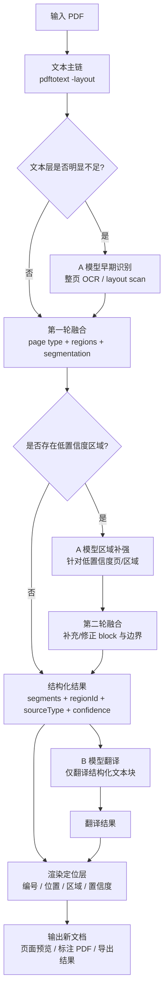

# PDF 翻译抽取 V2 方案

## 背景

当前翻译链路的核心流程是：

1. 用 `pdftotext -layout` 提取 PDF 文本层
2. 基于行、列、章节标题做切段
3. 用启发式规则决定“合并”或“拆分”
4. 将结构化段落送给模型翻译
5. 按段落编号回写到 PDF 标注稿

这条链在结构较稳定的样衣意见 PDF 上已经可用，但一旦 PDF 版式变化较大，容易出现：

- 该翻译的内容没有进入结构化结果
- 原本独立的短标签被并进长说明
- 原本是一条完整说明，却被拆成多个碎段
- 同页不同区域的内容被错误合并
- 业务侧误以为“模型漏翻”，实际是抽取层没有把内容切对

结论：当前风险主要来自抽取与分段，不是模型能力本身。

## 当前问题地图

### 1. 文本层抽取得到的是“布局近似文本”，不是页面语义结构

`pdftotext -layout` 能保留一定列布局，但不能直接表达：

- 文本属于哪一个图片说明区
- 箭头、标尺、标注线的指向关系
- 页面中不同 block 的边界
- 表格单元格边界

这导致后续规则只能依靠“行号、列号、相邻关系”去猜结构。

### 2. 当前规则是行级启发式，容易在复杂版式下失效

当前规则适合处理：

- 同列连续说明
- 明显的短续词
- 部分短标签和属性项

但对下面这些情况不够稳：

- 左右双栏 + 中间插图
- 同页既有长说明又有短标签
- 参考图页、颜色页、细节页混合
- 表格页和自由标注页混排

### 3. 没有明确的“页面类型”概念

当前逻辑默认所有页都走一套抽取思路，但实际上至少应区分：

- `Sketch / Comment Sheet`
- `TP / BOM / Table-heavy`
- `Reference / Colour Card`
- `Mixed Layout`
- `Scanned / OCR-heavy`

不同类型页面的正确切段策略并不相同。

### 4. 没有显式置信度

当前系统会输出结构化结果，但不会告诉用户：

- 哪一段是高置信度切出来的
- 哪一段是低置信度猜出来的
- 哪一段可能被误并或误拆

缺少这一层，会让业务误把抽取错误当成翻译错误。

## V2 目标

V2 不是继续堆 if/else，而是把抽取层升级为：

1. 页面类型识别
2. 页面区域切分
3. 区域内块级抽取
4. 块内段落合并
5. 低置信度标记

核心原则：

- 长工艺说明优先合并为完整段落
- 短标签、属性项、图片标题优先单独保留
- 不跨区域乱并
- 不确定时宁可拆开并标低置信度，也不要误并成错误长句

## V2 架构

### A. 页面类型识别层

先判断每页属于哪一类，再决定使用哪套抽取策略。

建议类型：

- `sketch`
  - 典型特征：服装线稿、箭头说明、分散文字块
- `table`
  - 典型特征：网格、规格表、BOM、TP 行列结构
- `reference`
  - 典型特征：参考图片、颜色块、材料卡、小标题多
- `mixed`
  - 典型特征：图片、短标签、说明、尺寸同时出现
- `ocr_heavy`
  - 典型特征：扫描件、文本层差、OCR 噪声高

页面类型可基于以下信号做启发式判断：

- 行密度
- 列分布
- 数字/尺寸占比
- 标题/标签占比
- 是否存在明显表格行列节奏
- 文本平均长度

### B. 页面区域切分层

在页面类型确定后，先把页面切成多个区域，而不是直接在整页做段落合并。

区域切分目标：

- 分离左列、右列、底部说明区
- 分离图片附近短标签区域
- 分离表格块
- 分离颜色/参考图片区

建议输出结构：

```ts
type PageRegion = {
  id: string;
  pageNumber: number;
  regionType: 'label_cluster' | 'paragraph_block' | 'table_block' | 'reference_block';
  bucketRange: [number, number];
  lineRange: [number, number];
  textFragments: string[];
  confidence: number;
};
```

### C. 区域内块级抽取层

每个区域独立做切段，避免不同区域文本互相污染。

策略：

- `paragraph_block`
  - 允许续行合并
  - 允许长说明块合并
- `label_cluster`
  - 保守拆分
  - 短标签单独成段
- `table_block`
  - 按行块或单元格块抽取
  - 不使用自然段式合并
- `reference_block`
  - 保守拆成独立图片说明项

### D. 段落合并层

合并必须从“行级启发式”升级到“块内启发式”。

合并规则建议分两类：

#### 1. 强合并

适用于：

- 同区域、同列、连续长说明
- 前一行显然未结束
- 后一行明显是续句

例如：

- `... visible contrast`
- `tape`

#### 2. 强拆分

适用于：

- 短标签
- 属性值
- 图片说明标题
- 颜色项
- 结构名词项

例如：

- `No side seam`
- `Colour, Antique Silver`
- `Sleeve velcro as image`
- `Main fabric`
- `Stretch fabric`

### E. 置信度与回退层

为每个 segment 增加：

```ts
type SegmentConfidence = {
  sourceType: 'text_layer' | 'ocr' | 'inferred';
  layoutConfidence: number;
  mergeConfidence: number;
  translationConfidence?: number;
  reasons: string[];
};
```

低置信度段落策略：

- 页面上显式标注“可能切段不准”
- 自动加入待确认项
- 如有必要再进入多模态补识别

## 多模态的定位

多模态不是主链替代，而是补强层。

适合引入多模态的场景：

- 纯图片中的文字
- OCR 质量差的扫描件
- 箭头/尺寸/颜色块等视觉关系明显强于文本层
- 低置信度区域的二次确认

不建议把整条主链完全切成多模态的原因：

- 成本更高
- 速度更慢
- 可重复性更弱
- 纯文本 PDF 反而更适合结构化抽取

建议路线：

- 文本层做主链
- 低置信度区域才进入多模态补识别

## 目标执行流程

后续正式链路应按“识别、融合、翻译、回贴”分层：

1. 文本主链先用 `pdftotext -layout` 抽取 PDF 文本层
2. A 模型只负责辅助识别：
   - OCR / 文本块
   - bbox / 位置
   - 页面区域辅助判断
3. 算法融合层统一处理：
   - 页面类型识别
   - 多区域切分
   - 文本主链与视觉辅助链融合
   - 长说明合并 / 短标签拆分
   - 低置信度标记
4. B 模型只负责翻译结构化 block / segment
5. 渲染层根据位置与编号，将译文合并回新文档或标注稿
6. 输出策略层根据文档主类型分流：
   - `sketch/comment` -> `annotated PDF`
   - `TP/BOM/table-heavy` -> `bilingual table / xlsx / table-style pdf`
7. 渲染策略：
   - `sketch/comment`：原位双语优先（放不下回退编号侧注）
   - `TP/BOM/table-heavy`：优先表格包（`bilingual_table_bundle`）
   - `reference/colour/material` -> 原位短标签翻译 + 轻量补充说明
   - `structured xlsx` -> bilingual xlsx

关键约束：

- 不走“整份 PDF 直接多模态翻译”
- A 模型不负责最终翻译
- B 模型不负责页面结构识别
- 低置信度区域才触发视觉补强，避免全量走高成本链路
- 不同文档主类型必须走不同输出策略，不能强制统一 annotated PDF



## 近期实施顺序

## 文档类型与输出分流

当前不应只按两类文档处理，而应至少分成 4 类输入、4 类策略。

### 输入类型

1. `sketch / comment`
- 线稿
- 箭头批注
- 局部工艺说明
- 样衣意见页

2. `tp / bom / table-heavy pdf`
- tech pack
- BOM
- 尺寸表
- 材料表
- 行列结构强的工艺单

3. `reference / colour / material`
- 图片参考
- 色卡
- 面料/辅料说明页
- 短标签多、长说明少

4. `structured xlsx`
- 已经结构化的 Excel 表格
- 不应再走 OCR / 版面理解主链

### 输出策略

1. `annotated_pdf`
- 主要服务 `sketch / comment`
- 强调原位双语、原位批注、页内确认

2. `bilingual_table_bundle`
- 主要服务 `tp / bom / table-heavy pdf`
- 形式可包含：
  - bilingual xlsx
  - table-style pdf
  - 页面表格摘要

3. `label_overlay`
- 主要服务 `reference / colour / material`
- 强调图片旁短标签翻译和轻量说明

4. `bilingual_xlsx`
- 主要服务 `structured xlsx`
- 直接做列级翻译和双语列生成

### 业务评分反馈的设计含义

#### 3 分案例

`Cici Rain Jacket - sketch.annotated.pdf`

结论：

- 路线基本正确
- 问题主要在质量不足
- 可以继续沿 `annotated_pdf` 路线优化

优化重点：

- 长说明合并更准
- 短标签拆分更准
- 原文与中文对位更稳
- 降低漏译与截断
- 优先走“原位双语”，放不下时再回退编号/侧注

#### 0 分案例

`Macade TP Cici Rain Jacket W.annotated.pdf`

结论：

- 问题不是单纯翻译质量差
- 更本质的问题是输出策略错误
- `TP/BOM/table-heavy` 文档不应继续以 annotated PDF 作为主结果

优化重点：

- 保住表格结构
- 按行/列/单元格翻译
- 提供 bilingual xlsx / table-style pdf
- 页面上不再默认打开注释式 PDF，而是优先展示表格结果入口

### 当前优化优先级

1. 先把 `0 分` 的 `tp/bom/table-heavy` 文档拉到“可确认”
2. 再把 `3 分` 的 `sketch/comment` 文档从“勉强可用”提升到“顺手可用”

### P0

1. 文本主链 + `early gate`（仅判定和触发骨架，不宣称已接入真实 OCR）
2. 第一轮融合（page type + multi-region + rule-based segmentation）
3. 低置信度判定（规则组合，阈值常量化）
4. 第二轮融合占位（先打通链路与可观测性）
5. 元数据透传（`sourceType / layoutConfidence / mergeConfidence`）
6. 全链路评估脚本（`npm run eval:fullchain`）可输出 A/B 调用状态与人工复核待办
7. 业务主链接入：`service.ts` 调用 `translation-pipeline.ts`，A 走 `vision-extraction.ts`，B 仅翻译结构化 segment
8. 输出策略已进入结果结构：`documentMainType` + `outputStrategy` + strategy-specific outputs

### P1

1. 为 `table` 类型页面引入行块抽取
2. 为 `reference` 类型页面引入图片说明块抽取
3. 页面上显示“低置信度段落”
4. 真实 Qwen API 环境下完成 A/B 调用验证并沉淀人工+AI评估结论
5. 第二轮融合从占位升级为真实纠偏合并（当前仅触发与记录）

## 导出产物现状（本轮后）

- `tp/bom/table-heavy`
  - 输出策略：`bilingual_table_bundle`
  - 当前已具备可下载成品：
    - `bilingual_xlsx`：`outputs.bilingualTableBundle.downloadable.relativePath`（默认落地 `.tmp/exports/`）
    - `table-style pdf`：`outputs.bilingualTableBundle.downloadableTableStylePdf.relativePath`（最小可用表格排版）
  - 本轮表格 PDF 进一步优化了换行（支持中文无空格 tokenization）、行高密度与跨页断点稳定性，但仍不宣称最终视觉定稿。
- `sketch/comment` 与 `mixed`（输出仍为 `annotated_pdf` 时）
  - 输出策略：`annotated_pdf`
  - 已消费 `inline_bilingual_preferred`：
    - 短文本优先 `inline`
    - 长文本回退 `footnote`
  - 已新增 `annotated_html_preview` 产物（`.tmp/exports/*.annotated-preview.html`）
  - 可通过 `/api/assistant/artifacts?path=<relativePath>` 直接预览（inline）
- 工作台：`AssistantReply.metadata.pdfArtifactLinks` 提供与 `finalArtifact` 一致的相对 URL，主按钮按 `primary` 区分 Excel vs 预览（**最小接入**，非完整产品级排版）
- 模型 fallback：`diagnostics` 含 B 批处理次数/成功解析次数/最近错误类型；`metadata.pipelineFallbackHints` 为脱敏说明（不含密钥）

### `documentMainType` 判型（实现要点）

- 版式计数按**页**聚合（每页一种 `pageLayoutType`），避免按 region 重复计数导致表格页占比虚高。
- 「表格段占全部 segment 比例」需与「表格页占全部页比例」联合使用，减轻线稿 PDF 中表格块拉高段占比的误判。

### P2

1. 引入多模态补识别
2. 仅对低置信度区域做视觉增强抽取

## Phase 1 当前实际状态（本轮后）

已完成：

- `file-extractor.ts`
  - `pdftotext -layout` 抽取封装
- `feedback-source.ts`
  - 第一版页面类型识别
  - 多区域切分（非单页单 region）
  - 第一版 segment 置信度和来源字段
  - `table/reference/mixed/sketch` 的基础分流策略
- `vision-extraction.ts`
  - 仅接口骨架和 fallback

未完成：

- 真实 bbox 级区域定位（当前仅文本列/间隔切分）
- `table` 页更精细的单元格结构恢复（当前按行块 + 空格分列）
- `details` / `colours` 的独立精细策略
- 真实 OCR / 多模态 provider 接入
- `extractionMeta` 透传到翻译/PDF 链

注意：

- `reference` 页已按 `pageLayoutType -> regionType` 走保守拆分。
- `table` 页已走独立的行块/分列策略，但仍存在过判风险。
- `details / colours` 仍未独立建模。
- 当前主链仍然是 `pdftotext -layout -> feedback-source`，不是整份 PDF 直接多模态翻译。

## 实施约束

- 不为单一 PDF 写死特判
- 新规则必须至少拿两类不同格式文档回归
- 所有“看起来像修好了”的规则都要验证：
  - 长说明是否仍能合并
  - 短标签是否被错误吞并
  - 新文档是否被现有规则误伤

## 当前建议

下一步代码实现优先做：

1. 页面类型识别与区域切分
2. `details` 页与 `reference` 页策略分流
3. segment 置信度结构

不建议继续单纯在行级规则上反复补丁。

---

## Phase 1 设计结论（简短）

- **页面类型识别**：先做，轻量 heuristic（sketch/table/reference/mixed），输出供后续策略使用
- **视觉辅助抽取层**：统一接口 + fallback，不接真实 OCR；职责为“可插拔 provider、输出 block 含 page/region/text/confidence/sourceType”
- **融合层**：当前仅透传 text_layer；结构预留，后续可合并 vision blocks
- **进入结构化结果**：segment 含 `sourceType`、`layoutConfidence`、`mergeConfidence`、`regionId`；section 含 `pageLayoutType`
- **先不做**：真实 OCR/多模态、页面多区域切分、表格行块抽取、UI 低置信度展示

---

## Phase 1 实施记录（Vision-Assisted Extraction Skeleton）

### 已完成

| 项 | 文件 | 说明 |
|----|------|------|
| 视觉辅助抽取接口 | `src/lib/assistant/vision-extraction.ts` | 统一接口 `ExtractedBlock`、`VisionExtractionProvider`；当前为 fallback 透传，未接真实 OCR |
| 文本抽取主链 | `src/lib/assistant/file-extractor.ts` | `pdftotext -layout` 封装，按 form-feed 分页 |
| 页面布局类型 | `feedback-source.ts` | 轻量 heuristic 区分 `sketch` / `table` / `reference` / `mixed` |
| 区域/块概念 | `feedback-source.ts` | `ExtractedRegion` + 多区域切分（按缩进列/空行间隔） |
| 段置信度 | `types.ts` `SegmentExtractionMeta` | `sourceType`、`layoutConfidence`、`mergeConfidence`、`regionId` |
| 抽取规则 | `feedback-source.ts` | 短标签强拆、续行合并；**`reference_block` 保守策略**（短行必拆、合并置信度下调） |

### 仅为骨架（未接真实能力）

- `vision-extraction.ts`：provider 未调用，仅透传 text_layer
- 多模态/OCR：未接
- 页面多区域切分：已接入主抽取链（仍是文本启发式，不含视觉 bbox）
- `ocr_heavy` 类型：未实现

### 未完成

- 真实 OCR / 多模态 provider
- 表格页行块抽取（已独立；仍需提升单元格边界质量）
- UI 展示低置信度
- `details` / `references` / `colours` 页的细粒度策略分流（当前仅有基础分流，仍需更细粒度规则）
